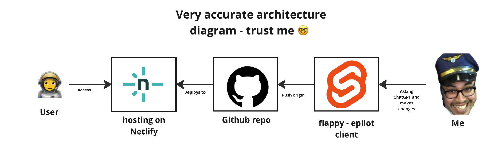

Build status:

# 
TGIF!!!

This is undoubtedly the best flappy epilot game out there 😁. What it is? 

Click 👇🏼 to play and find out 

#

</a>

Thanks to Jakub who helped me debugging the text selection and being my first tester 😁💪

## 
 Wanna help me improve this game or work on other even better things? <a href="https://www.epilot.cloud/en/company/careers/developers-engineering"> Join epilot 🚀</a>

